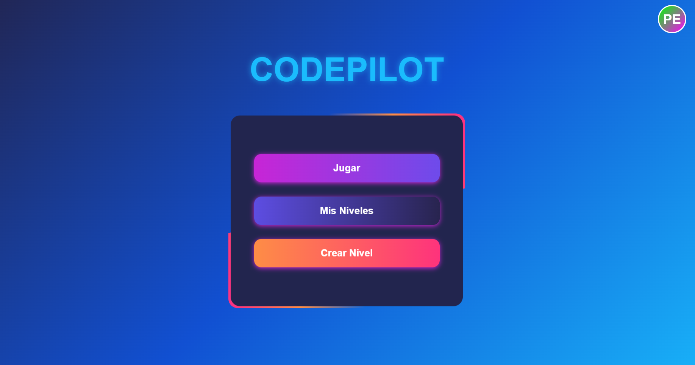
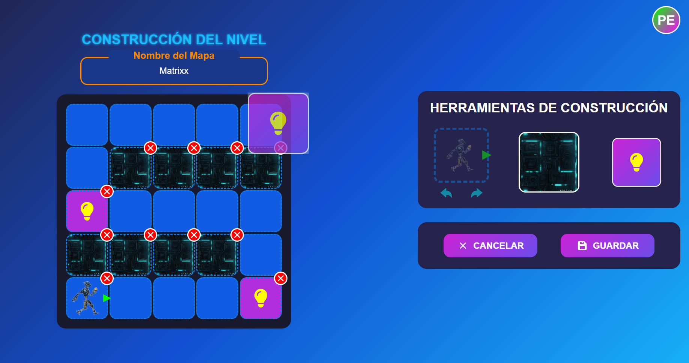
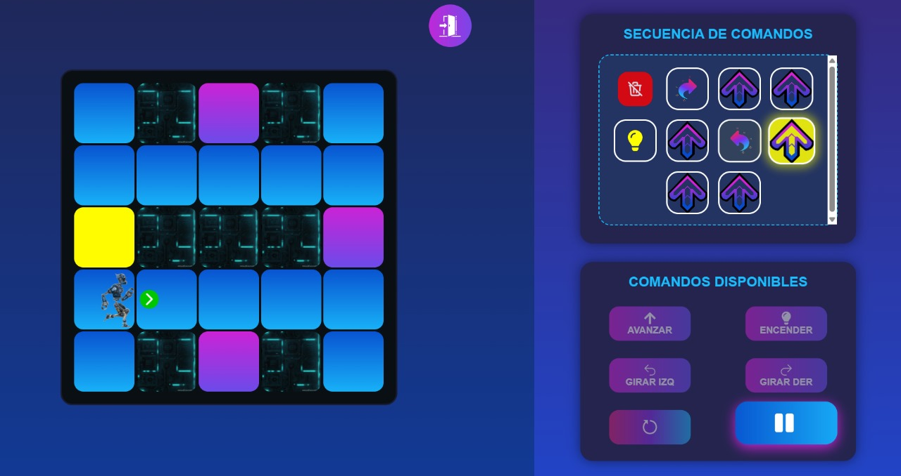

# 🧠 CodePilot: Juego de lógica con programación visual

**CodePilot** es un juego educativo estilo LightBot desarrollado con **React** y **Supabase**, diseñado para enseñar conceptos básicos de lógica y programación como movimiento secuencial, orientación y resolución de problemas mediante mapas interactivos.

## 🚀 Características

- 🧩 **15 niveles básicos** para aprender movimiento y dirección.
- 🛣️ **15 desafíos prácticos** para reforzar lo aprendido.
- 🔁 **15 rutinas variadas** con nuevos caminos y posiciones.
- ✍️ **Creador de mapas personalizados** con editor visual.
- 💾 **Autenticación y almacenamiento** con Supabase.
- 🌐 **Responsive**: compatible con computadoras y móviles (editor solo en PC).
- 🍪 **Inicio de sesión con cookies seguras**.

## 🛠️ Tecnologías utilizadas

- ⚛️ **React 19** + Vite
- 🔥 **Supabase** (Auth, DB, Realtime)
- 🎨 CSS personalizado + React Icons
- 📦 Deploy con **Vercel** (frontend) y **Render** (backend)

## 📷 Capturas





## 🧪 Instalación local

1. Clona este repositorio:

```bash
   git clone https://github.com/SEVERNASTER/CODEPILOT.git
   cd CODEPILOT
```

2. Instala las dependencias, copia y pega estos comandos y correlos de una vez para instalar dependencias tanto en el frontend como en el backend

``` bash
    cd frontend/
    npm install --legacy-peer-deps
    cd ../backend
    npm install --legacy-peer-deps
```

# ⚠️ Nota importante:
Si ocurre algún error relacionado con dependencias (npm ERR!), ejecuta el siguiente comando como alternativa:
``` bash
    npm install --force
```

## 🔐 Variables de entorno

### Dentro de la capeta frontend crear un archivo `.env`

```env
    VITE_BACKEND_URL=http://localhost:3000
    VITE_BACKEND_URL: URL del backend desplegado (por ejemplo en Render) o local (http://localhost:3000).
```